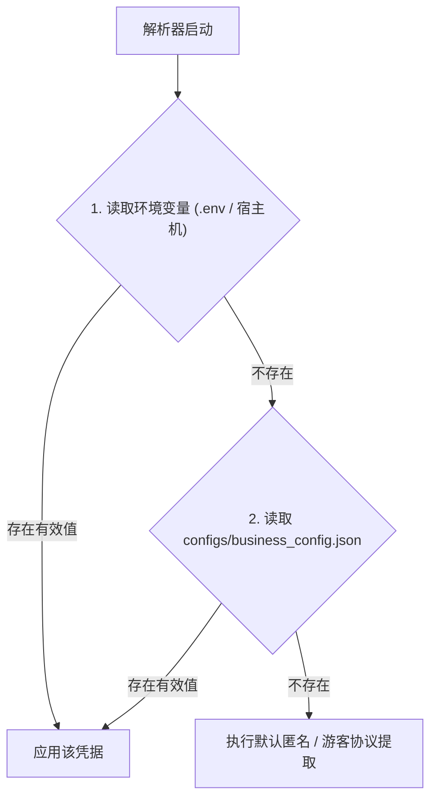

# 全平台 Cookie 与凭证配置指南 (Cookie Configuration Guide)

本文档详细说明 Media Parser 中各平台 Cookie 凭证的作用、获取方式、最小必要字段推荐以及安全配置实践。

---

## 1. 平台凭据矩阵概览

> **核心原则**：本项目 95%+ 的平台**完全无需任何 Cookie 即可直接匿名解析**。仅在特定平台遇到强风控阻断，或提取特定平台的高清原画流时，才需要配置对应 Cookie。

| 平台名称 | 环境变量 Key | 别名支持 | 必要性 / 使用场景 | 推荐精简字段 |
| :--- | :--- | :--- | :--- | :--- |
| **小红书** | `XHS_COOKIE` | `XIAOHONGSHU_COOKIE` | 🟡 **可选 (防风控)**：日常免 Cookie 解析；机房 IP 遭遇 302 登录拦截时配置 | `a1=xxx; webId=xxx; web_session=xxx;` |
| **微信视频号** | `YUANBAO_COOKIE` | `WECHAT_CHANNELS_COOKIE` | 🔐 **必需 (媒体流)**：提取视频号无水印视频流与图集（依赖腾讯元宝接口） | `hy_user=xxx; hy_token=xxx;` |
| **快手** | `KUAISHOU_COOKIE` | `KS_COOKIE` | 🟡 **可选 (防风控)**：日常免 Cookie 解析；触发 `result: 2` 反爬时配置 | `kpf=PC_WEB; kpn=KUAISHOU_VISION; did=xxx;` |
| **拼多多** | `PINDUODUO_COOKIE` | `PDD_COOKIE` | 🟡 **部分依赖**：商品图集免 Cookie；多多视频短视频流解析需要 | `PDDAccessToken=xxx;` |
| **豆包 AI** | `DOUBAO_COOKIE` | - | 🟡 **可选 (无水印)**：公开图文免 Cookie；提取 1080P 无水印视频需要 | `sessionid_ss=xxx;` |
| **即梦 AI** | `JIMENG_COOKIE` | - | 🟡 **可选 (扩展鉴权)**：公开分享免 Cookie；私有草稿/活动页鉴权需要 | `sessionid=xxx;` |
| **微博** | `WEIBO_COOKIE` | - | 🟡 **可选 (防访客限制)**：常规公开博文免 Cookie；机房 IP 遭遇访客拦截或解析粉丝可见内容时配置 | `SUB=xxx;` |
| **抖音** | `DOUYIN_COOKIE` | `DY_COOKIE` | 🟢 **常规免配 (100% 免配)**：常规短视频/普通图文/音乐无需任何凭据；<br/>🟡 **实况图 (机房 IP)**：需完整登录 Cookie + `UIFID`；<br/>🟡 **放映厅长片**：需滑块通行证 `s_v_web_id` | 实况图需: `UIFID=xxx; sessionid=xxx; sessionid_ss=xxx; passport_csrf_token=xxx; odin_tt=xxx;`<br/>(即完整登录 Cookie 拼入 UIFID)；<br/>放映厅需: `s_v_web_id=verify_xxx;` |

---

## 2. 凭证配置方式与优先级

系统支持多种配置渠道，读取优先级从高到低如下：



### 方式 A：通过 `.env` 环境变量配置（推荐，最安全便捷）
在项目根目录创建或编辑 `.env` 文件（参考 [.env.example](file:///Users/leo/Projects/media-parser/.env.example)）：
```env
# 小红书
XHS_COOKIE="a1=xxx; webId=yyy;"

# 腾讯元宝（用于视频号解析）
YUANBAO_COOKIE="hy_user=xxx; hy_token=yyy;"

# 快手
KUAISHOU_COOKIE="did=web_xxx;"

# 拼多多
PINDUODUO_COOKIE="PDDAccessToken=xxx;"

# 豆包
DOUBAO_COOKIE="sessionid_ss=xxx;"

# 抖音（提取实况动图流时填入）
DOUYIN_COOKIE="UIFID=xxx;"
```

> **💡 关于引号书写与 Docker Compose 兼容性**：
> 在 `.env` 中无论使用双引号 `KEY="value"`、单引号 `KEY='value'` 或无引号 `KEY=value`，解析器底层的 `CookieManager` 均已实现自动去除首尾引号与空格，杜绝 Docker Compose 将包裹引号作为 Cookie 键名（如变成 `'sessionid` 或 `'UIFID`）导致凭据失效的问题。

### 方式 B：通过 Docker Compose 部署
在 [docker-compose.yml](file:///Users/leo/Projects/media-parser/docker-compose.yml) 所在的目录下编写 `.env`，Docker Compose 启动时会自动将变量注入容器环境：
```bash
docker compose up -d
```

### 方式 C：通过 `configs/business_config.json` 静态配置
可以在配置文件中的 `platform_cookies` 节点下配置（注意：避免将包含个人敏感凭据的文件提交到公开 Git 仓库）：
```json
{
  "platform_cookies": {
    "xhs": "a1=xxx; ...",
    "kuaishou": "did=xxx; ...",
    "pinduoduo": "PDDAccessToken=xxx; ...",
    "yuanbao": "hy_user=xxx; hy_token=xxx; ..."
  }
}
```

---

## 3. 各平台 Cookie 提取步骤 (How-to Guide)

### 3.1 小红书 (`XHS_COOKIE`)
1. 使用电脑浏览器打开 [小红书网页版 (xiaohongshu.com)](https://www.xiaohongshu.com/) 并登录账号。
2. 按 `F12` 打开浏览器开发者工具，切换到 **Application (应用) -> Cookies -> https://www.xiaohongshu.com**。
3. 提取以下核心字段拼装成字符串：
   ```text
   a1=你的a1值; webId=你的webId值; web_session=你的web_session值;
   ```
4. 填入 `.env` 中的 `XHS_COOKIE`。

### 3.2 腾讯元宝 / 微信视频号 (`YUANBAO_COOKIE`)
> 视频号解析依托腾讯元宝的官方智能联网协议，因此需配置腾讯元宝登录态。
1. 使用电脑浏览器打开 [腾讯元宝 (yuanbao.tencent.com)](https://yuanbao.tencent.com/) 并使用微信扫码登录。
2. 按 `F12` 打开开发者工具，切换到 **Network (网络)** 标签页。
3. 在页面上随意发起一次对话或刷新页面，在任意接口请求的 Request Headers 中找到 `Cookie`。
4. 提取其中的核心字段（必须包含 `hy_user` 与 `hy_token`）：
   ```text
   hy_user=你的hy_user值; hy_token=你的hy_token值;
   ```
5. 填入 `.env` 中的 `YUANBAO_COOKIE`。

### 3.3 快手 (`KUAISHOU_COOKIE`)
1. 访问 [快手官网 (kuaishou.com)](https://www.kuaishou.com/)。
2. 打开 `F12` 开发者工具，在 **Application -> Cookies** 中提取：
   ```text
   did=你的did值; kpf=PC_WEB; kpn=KUAISHOU_VISION;
   ```
3. 填入 `.env` 中的 `KUAISHOU_COOKIE`。

### 3.4 拼多多 (`PINDUODUO_COOKIE`)
1. 手机浏览器或 PC 浏览器开启移动端模拟，访问 `mobile.yangkeduo.com`（拼多多 H5 页面）并登录。
2. 在 **Application -> Cookies** 中提取：
   ```text
   PDDAccessToken=你的AccessToken值;
   ```
3. 填入 `.env` 中的 `PINDUODUO_COOKIE`。

### 3.5 豆包 AI (`DOUBAO_COOKIE`)
1. 访问 [豆包官网 (doubao.com)](https://www.doubao.com/) 并登录。
2. 在 **Application -> Cookies** 中找到并提取：
   ```text
   sessionid_ss=你的sessionid_ss值;
   ```
3. 填入 `.env` 中的 `DOUBAO_COOKIE`。

### 3.6 抖音 (`DOUYIN_COOKIE`)

#### 3.6.1 场景与所需字段一览表

整个项目统一使用单一环境变量 `DOUYIN_COOKIE`，分为三种情况：

| 业务场景 | 所需字段 | `DOUYIN_COOKIE` 配置示例 | 机制说明 |
| :--- | :--- | :--- | :--- |
| **1. 日常常规作品**<br/>(常规短视频 / 普通图文图集 / 背景音乐) | **无需配置**<br/>(100% 免配) | `DOUYIN_COOKIE=`<br/>*(留空即可)* | 直连移动端 Feed 核心通道与分享页 SSR，免 Cookie、免签名、毫秒级直出。 |
| **2. 云服务器提取实况图**<br/>(LivePhoto MP4 动态流) | 需**完整登录 Cookie + `UIFID`**<br/>(最少字段：sessionid, sessionid_ss, passport_csrf_token, odin_tt 加上 UIFID) | `DOUYIN_COOKIE="UIFID=ccaf4...; sessionid=...; sessionid_ss=...; passport_csrf_token=...; odin_tt=...;"` | 实况视频轨仅由 Web 详情 API 下发。在云服务器机房 IP 下，**仅填 UIFID 是不够的**，必须同时具备登录态权限与 UIFID 设备指纹。系统会自动纯算 `x-secsdk-web-signature` 穿透 Argus 门禁。<br/>⚠️ **重要**：`uifid` 在 Network 中是与 `Cookie` 同级的独立请求头，需手动在 `DOUYIN_COOKIE` 中以 `UIFID=xxx;` 格式追加拼入！ |
| **3. 放映厅长视频 / 短剧**<br/>(`/lvdetail/` 影视长片) | 需包含 **`s_v_web_id`**<br/>*(滑块通行证)* | `DOUYIN_COOKIE="s_v_web_id=verify_xxx; sessionid=xxx;"` | 涉及长片版权与严格人机验证，需在浏览器通过拼图滑块后获取 `s_v_web_id` 通行证。 |

---

#### 3.6.2 疑问解答：只填 UIFID 行不行？实况图到底需要哪些字段？

* **明确结论：仅填 UIFID 是不行的！必须是【完整登录 Cookie】加上【UIFID】共同填入 `DOUYIN_COOKIE`。**
* **为什么两者缺一不可？**
  1. **登录会话凭据（`sessionid`、`sessionid_ss`、`passport_csrf_token`、`odin_tt` 等）**：
     - Web 详情接口下发的 `image_post_info` 及 LivePhoto 实况动轨受访问控制，未登录状态在机房 IP 会被限制或返回空数据；
  2. **设备指纹（`UIFID` 及 `x-secsdk-web-signature`）**：
     - 字节跳动 ArgusSecurityPlugin 安全网关对机房 IP 强制校验 `uifid` 请求头及 `x-secsdk-web-signature` 签名，缺失则直接报 403 阻断；
  3. **协同生效**：
     - 只有在 `DOUYIN_COOKIE` 中**同时具备登录凭据和 `UIFID`** 时，解析器才能既突破 Argus 403 门禁，又获得 Web API 正常返回的高清实况 MP4 视频流。
* **为什么复制的完整 Cookie 里面没有 UIFID？**
  * 在浏览器 F12 的 **Network（网络）** 抓包中，向抖音发起的 HTTP 请求标头结构为：
    - 标头 A：`Cookie: sessionid=...; passport_csrf_token=...; odin_tt=...;`
    - 标头 B：`uifid: ccaf4ddfc567c2ea7983832ca...`
  * **`uifid` 是与 `Cookie` 并列同级的独立自定义请求头**。如果直接复制 `Cookie:` 标头，里面是**绝对没有** `UIFID` 的！必须把 `uifid` 的值手动以 `UIFID=xxx;` 拼入 `DOUYIN_COOKIE`。
* **推荐最少必要字段**：
  ```env
  DOUYIN_COOKIE="UIFID=你的uifid值; sessionid=你的sessionid; sessionid_ss=你的sessionid_ss; passport_csrf_token=你的csrf_token; odin_tt=你的odin_tt;"
  ```
  *(或者直接把浏览器 Network 里的整串 `Cookie` 复制下来，并在最前面或最后面拼上 `UIFID=你的uifid值;`。代码会自动脱敏过滤 `bd_ticket_guard_*` 等毒药字段)*

---

#### 3.6.3 如何提取凭据并配置到 `DOUYIN_COOKIE`

1. **登录抖音网页版**：在电脑浏览器打开 [抖音网页版 (douyin.com)](https://www.douyin.com/) 并完成账号登录。
2. **提取 Cookie 标头**：
   * 按 `F12` 打开开发者工具 $\rightarrow$ 切换到 **Network (网络)** 标签页；
   * 刷新页面或点击任意作品，在请求列表中找到任意以 `/aweme/v1/web/` 开头的请求；
   * 在 **Request Headers (请求标头)** 中找到 **`Cookie`**，复制其完整内容。
3. **提取 uifid 独立标头**：
   * 在同一个请求的 **Request Headers** 中找到 **`uifid`**，复制该 256 位十六进制字符串。
4. **拼装写入 `.env`**：
   ```env
   # 将 UIFID=你的值; 与复制的 Cookie 拼在一起：
   DOUYIN_COOKIE="UIFID=ccaf4ddfc567c2ea...; sessionid=...; sessionid_ss=...; passport_csrf_token=...; odin_tt=...;"
   ```

---

#### 3.6.4 放映厅长视频凭据提取 (`s_v_web_id`)

若需在云端提取抖音放映厅影视长片或短剧 (`/lvdetail/`)：
1. 在电脑浏览器打开目标长视频页面，若弹出拼图滑块，完成滑块拖动验证；
2. 按 `F12` 打开 **Application -> Cookies -> https://www.douyin.com**；
3. 复制滑块通行证 `s_v_web_id`（通常形如 `verify_mxxx...`）以及登录态 `sessionid`（若该长片需要 VIP/登录权限）；
4. 填入 `.env`：
   ```env
   DOUYIN_COOKIE="s_v_web_id=verify_mtr655rg_ZG8sERuu_...; sessionid=...;"
   ```
   *(代码已内置路由隔离，常规短视频解析时会自动过滤此滑块码，避免过期滑块干扰主路径)*

### 3.7 微博 (`WEIBO_COOKIE`)
1. 访问 [微博网页版 (weibo.com)](https://weibo.com/) 并登录账号。
2. 按 `F12` 打开开发者工具，在 **Application -> Cookies -> https://weibo.com** 中提取：
   ```text
   SUB=你的SUB值;
   ```
3. 填入 `.env` 中的 `WEIBO_COOKIE`（用于解决机房 IP 访客限制或提取粉丝可见博文/高码率视频）。

---

## 4. 常见错误码与排查指引

当请求的链接触发目标平台风控或凭证失效时，系统会返回明确的 HTTP 400 状态码与结构化 `error_code`：

| 错误码 (`error_code`) | 含义说明 | 解决方案 |
| :--- | :--- | :--- |
| `XIAOHONGSHU_COOKIE_REQUIRED` | 小红书触发服务器 IP 拦截，需要登录 Cookie 校验 | 在 `.env` 中配置或更新 `XHS_COOKIE` |
| `KUAISHOU_COOKIE_REQUIRED` | 快手触发反爬风控校验（`result: 2` / `ANTICRAWL_DEFAULT`） | 在 `.env` 中配置或更新 `KUAISHOU_COOKIE` |
| `WECHAT_CHANNELS_COOKIE_REQUIRED` | 视频号缺少腾讯元宝凭证，无法提取无水印流 | 在 `.env` 中配置有效的 `YUANBAO_COOKIE` |
| `PINDUODUO_COOKIE_REQUIRED` | 拼多多短视频接口返回 403 鉴权失败 | 在 `.env` 中配置最新的 `PINDUODUO_COOKIE` |
| `MEDIA_DELETED_OR_PRIVATE` | 作品已被创作者删除、设为私密或仅自己可见 | 确认源链接是否能在未登录浏览器中公开播放 |

---

## 5. 安全与运维最佳实践

1. **推荐使用小号/测试账号**：
   - 绝不要使用绑有重要资产、支付权限的个人主账号提取 Cookie。
   - 建议注册专门的抓取小号用于日常解析。
2. **凭据隔离与防泄漏**：
   - `.env` 文件已被 `.gitignore` 忽略，请切勿将其提交到公共 Git 仓库。
   - 生产环境推荐通过容器编排环境变量或密钥管理服务注入。
3. **Cookie 定期轮换**：
   - 大部分平台的 Web 登录态有效期在 30~90 天之间；遇到对应平台的 `*_COOKIE_REQUIRED` 报错时，及时在 `.env` 中更新并重启服务即可。
