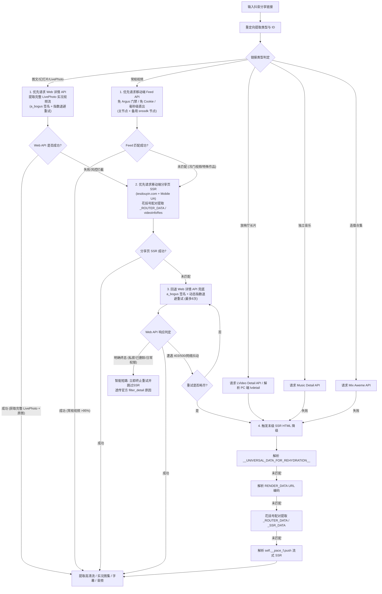

# 抖音 (Douyin) 逆向解析指南

本篇详细记录抖音平台短视频、图文笔记、LivePhoto 实况、独立音乐/原声、连载合集及原生 AI 字幕的完整逆向提取方案、签名机制、容灾降级策略及踩坑经验。

---

## 1. 平台特征与支持能力

* **平台标识**：`抖音`
* **支持媒体类型**：
  * 无水印高清视频 (智能码率排序，优先选取兼容性最好的 H.264 编码，无缝兼容 H.265/HEVC)
  * 放映厅 / 影视长片 / 连载短剧 / 剧场短片 (单集与全集列表 `video_list`，标题 `【放映厅】...` 或 `【短剧】...`)
  * 高清图文图集 (无水印原图)
  * 动态实况照片 (LivePhoto 动态视频流)
  * 背景音乐 / 独立原声 (Audio MP3)
  * 连载合集 / 短剧专题 / 短剧详情页 (多分集视频列表 `video_list`，支持 `/share/playlet/detail/<id>`)
  * 原生 AI 生成字幕 (WebVTT 格式，含多语言代码与字幕 ID)
* **常见链接形态**：
  * 短链接：`https://v.douyin.com/Nid-fFF_sdI/`
  * 移动网页端分享长链：`https://m.douyin.com/share/video/7685345542323834441`
  * 网页端放映厅长片长链：`https://www.douyin.com/lvdetail/7677129845654061595`
  * 网页端短剧详情长链：`https://www.douyin.com/share/playlet/detail/7604472147116556322` 或 `https://www.douyin.com/playlet/detail/...`
  * 网页端视频长链：`https://www.douyin.com/video/7616399587141737704`
  * 网页端图文长链：`https://www.douyin.com/note/7616399587141737704`
  * 网页端独立音乐长链：`https://www.douyin.com/music/7123456789012345678`
  * 网页端合集长链：`https://www.douyin.com/collection/7123456789012345678`
* **Cookie 依赖**：
  * **普通视频与普通图文 (100% 免配)**：完全无需用户登录 Cookie。常规视频直连**移动端 Feed 核心通道**（免 Argus 门禁、免 Cookie、免签名、毫秒级直出）；普通图文自动通过分享页 SSR 提取高清原图。
  * **LivePhoto 实况动图 (`live_photo_url`)**：因动图流仅由 Web API (`/aweme/v1/web/aweme/detail/`) 下发，在住宅 IP / 本地环境下自动提取实况动图流；云服务器机房 IP 遭遇风控时自动保底降级为全量静态原图。
  * **放映厅长片 (`/lvdetail/`)**：受字节跳动严格风控保护，可在 `.env` 中配置人机滑块通行证 `DOUYIN_COOKIE="s_v_web_id=verify_..."`（代码已做路由隔离，常规作品会自动剔除过期验证码）。

---

## 2. 链路追踪与 ID 提取

1. **302 重定向**：通过 `WebFetcher.fetch_redirect_url` 跟随短链 302 跳转至标准长链接，并保留 `ep_id`、`album_id` 等关键参数。
2. **ID 提取**：使用 `UrlParser.get_video_id` 自动从 `/video/`、`/note/`、`/music/`、`/collection/`、`/lvdetail/` 及 `ep_id` 参数匹配作品/分集 ID。

---

## 3. 核心逆向方案与多轨容灾机制

抖音解析采用 **图文/LivePhoto 优先 Web API (含实况视频流) + 常规视频移动端 Feed 免 Argus 主路径 + 移动端分享页 SSR 免签名次主路径/图文降级 + Web API 退避重试兜底 + SSR HTML 末级容灾 + 流式 SSR (RSC) 深度解析** 的异构高可用架构。



### 3.1 移动端 Feed 核心通道（常规视频主路径）
* **接口定义**：
  ```text
  主节点：https://api5-normal-c-hl.amemv.com/aweme/v1/feed/?aweme_id={aweme_id}&aid=1128
  备用节点：https://aweme.snssdk.com/aweme/v1/feed/?aweme_id={aweme_id}&aid=1128
  ```
* **核心优势**：
  * **绕开 Argus 门禁**：走移动端 App 推荐流协议，不经过 PC Web 端的 `ArgusSecurityPlugin`；
  * **零风控依赖**：无需 `UIFID`、`x-secsdk-web-signature`、`a_bogus`、`msToken` 或任何 Cookie；
  * **高性能与高可用**：测试中常规视频 403 率为 0%，端到端耗时仅约 200ms；支持主备节点智能故障转移（若主节点未收录，自动故障转移至备用 `snssdk` 节点继续尝试）。

### 3.2 图文与 LivePhoto 实况的 Web 详情主路径与 SSR 降级
* **LivePhoto 核心提取原理**：
  * 抖音图文与 LivePhoto 实况动图作品中，**仅 PC Web 详情接口 (`/aweme/v1/web/aweme/detail/`) 会在 `images[i].video.play_addr` 中下发实况动图的 MP4 视频流**；
  * 移动端分享页 SSR (`iesdouyin.com/share/...`) 的 HTML 中只包含基础静态图片 URL，不包含实况视频流；
  * 因此，对于图文/幻灯片作品（`note` / `slides`），**必须优先请求 PC Web 详情接口以获取完整的实况动图**；若遇到 Argus 403 风控，再自动降级至分享页 SSR 保证静态图片不失效。
* **移动端分享页 SSR 解析与嵌套 JSON 花括号深度栈提取**：
  * **PC 端 CSR 空壳规避**：现代抖音 PC 网页端 (`www.douyin.com/video/{id}`) 属于纯客户端渲染（CSR）空壳页面（72KB 空 HTML，无内嵌数据）；而移动端分享页 `https://www.iesdouyin.com/share/video/{id}` 配合 Android 移动端 User-Agent，服务端依然完整输出包含 `_ROUTER_DATA` 与 `videoInfoRes.item_list` 的 SSR 数据；
  * **花括号深度栈提取**：通过 `_extract_json_object_after` 实现字符级花括号深度配对与转义字符跳过，彻底解决传统非贪婪正则 `\{.*?\}` 遇到首个 `}` 提前截断导致的 `JSONDecodeError`。

### 3.3 Web 详情接口与智能短路退避重试（兜底路径）
* **作品详情接口**：
  ```text
  https://www.douyin.com/aweme/v1/web/aweme/detail/?device_platform=webapp&aid=6383&channel=channel_pc_web&aweme_id={aweme_id}&msToken={ms_token}&a_bogus={a_bogus}
  ```
* **适用场景**：图文/实况作品主路径，以及常规视频前两步（Mobile Feed 与分享页 SSR）均未收录时的末级兜底防护网。
* **退避重试与终态短路双重机制**：
  * **针对 Argus 概率性 403**：严格保留最大 8 次重试与紧凑退避（单次上限 0.8s），为特殊受限作品提供最终兜底保障；
  * **针对不可重试终端状态（短路熔断）**：当 Web API 明确返回已删除、仅自己可见或朋友日常权限等终端状态（`status_code == 0` 且带有 `filter_detail`）时，`_is_terminal_failure` 立即生效，**在第 1 次响应后立即终止重试**，并跳过无意义的 SSR HTML 兜底，将失效链接的整体耗时从 11~14 秒压缩至亚秒/秒级。
* **独立音乐详情接口**：
  ```text
  https://www.douyin.com/aweme/v1/web/music/detail/?music_id={music_id}&device_platform=webapp&aid=6383&channel=channel_pc_web&msToken={ms_token}&a_bogus={a_bogus}
  ```
* **合集作品列表接口**：
  ```text
  https://www.douyin.com/aweme/v1/web/mix/aweme/?mix_id={mix_id}&cursor=0&count=20&device_platform=webapp&aid=6383&channel=channel_pc_web&msToken={ms_token}&a_bogus={a_bogus}
  ```
* **放映厅长视频接口**：
  ```text
  https://api5-normal-c-hl.amemv.com/aweme/v1/lvideo/detail/?episode_id={ep_id}&album_id={album_id}&aid=1128
  ```
* **必备请求头**：
  * `User-Agent`：必须与签名计算时传入的 UA 严格一致（见 [BogusSigner](file:///Users/leo/Projects/media-parser/utils/signer/bytedance/bogus_signer.py)）。
  * `Referer`：根据内容形态动态区分（视频使用 `/video/{aweme_id}`，图文使用 `/note/{aweme_id}`）。
  * `Cookie`：携带 `ttwid` 及自定义 `DOUYIN_COOKIE`。

### 3.4 动态 TTWID 获取机制
抖音 Web 端详情接口要求必须携带有效的 `ttwid`。我们在 [DouyinParser](file:///Users/leo/Projects/media-parser/src/parsers/douyin_parser.py) 中实现了自动注册与类级别内存缓存：
```python
url = "https://ttwid.bytedance.com/ttwid/union/register/"
data = {
    "region": "cn",
    "aid": 6383,
    "need_t": 1,
    "service": "www.douyin.com",
    "domain": ".douyin.com"
}
resp = session.post(url, json=data)
ttwid = resp.cookies.get('ttwid')
```

### 3.5 签名计算 (a_bogus)
通过 `py_mini_racer` 在 Google V8 引擎中执行提取的前端混淆脚本，计算 `a_bogus` 防篡改签名：
```python
from utils.signer.bytedance.bogus_signer import BogusSigner

signer = BogusSigner()
abogus = signer.get_abogus(play_url, signer.user_agent)
```

### 3.6 SSR HTML 免签名容灾降级与流式 SSR
当 API 遭遇风控（403/500/空数据）或面对放映厅长视频时，解析器自动回退到 SSR 页面数据抽取，覆盖 4 种主流结构：
1. `<script id="__UNIVERSAL_DATA_FOR_REHYDRATION__">`（现代 PC 网页端主流）；
2. `<script id="RENDER_DATA">`（经典版 URL 编码结构）；
3. 花括号栈配对提取 `window._ROUTER_DATA` / `window._SSR_DATA` / `window.__INIT_PROPS__`；
4. **React Server Components 流式 SSR (`self.__pace_f.push`)**：解析 Next.js / 字节流式传输切片，提取包含 `defaultAwemeInfo`、`lvideoBrief`、`videoModel.dynamicVideo` 的超高清流。

---

## 4. 字段提取与核心规则

### 4.1 视频画质与编码智能优选
* **码率降序排序**：解析 `bit_rate` 或 `dynamic_video_list` 列表，按码率从大到小排列。
* **优先 H.264 编码 (`is_h265 == 0` / `codec_type == 'h264'`)**：优先选取 H.264 最高码率视频流（最高支持 1080p 6.46Mbps），避免 H.265/HEVC 导致 Web 浏览器前端 `<video>` 标签黑屏无画面；若无 H.264 则回退至最高画质 H.265。
* **源站 CDN 节点优选**：`url_list` 优先取第 3 个节点（`url_list[2]`，源站节点），为空时取第 1 个。

### 4.2 图文与 LivePhoto 提取
* ⚠️ **防坑警示**：`download_url_list` 包含带官方水印的图片；**必须提取 `url_list[-1]`**（末尾项通常为无水印最高清原图）。
* **LivePhoto 识别**：若单张图片对象包含 `img['video']['play_addr']`，提取该视频流作为实况动图文件。

### 4.3 原生 AI 字幕提取
从 `video.cla_info.caption_infos` 与 `video.subtitle_infos` 中提取标准 WebVTT/SRT 字幕流，自动发起轻量请求获取并结构化解析为带时间轴的片段数组（`[{"start": 0.64, "end": 2.12, "text": "..."}]`），直接对齐 ASR / 歌词数据契约。

### 4.4 连载合集与多分集视频列表
* 当传入 `/collection/{mix_id}` 合集链接时，提取全集列表并注入 `video_list`，首集作为 `video_url`；
* 标题自动规范为 `【合集】{mix_name}`，封面提取合集官方封面。

### 4.5 放映厅 / 影视长片 / 连载短剧 (`/lvdetail/` 与 `/share/playlet/detail/`)
* **剧集与短剧选集**：
  * 放映厅长片解析 `lvideoBrief.albumInfo` 与 `lvideoBrief.episodeInfo`，标题自动格式化为 `【放映厅】{album_name} - {episode_name}`；
  * 剧场短剧 (`/playlet/detail/<id>`) 解析 `series_title` / `playlet_info`，标题自动格式化为 `【短剧】{series_title} - 第{ep}集`；
* **超清音视频分离提取**：从 `videoModel.dynamicVideo` 提取最高清 H.264 视频流（`video_url`）与独立音轨（`audio_url`）；
* 💡 **关于「抖音独播/独家」画面角标**：部分独播影视与演唱会长片画面右上角会显示「抖音 独播」或「独家」标签，该角标属于官方源片入库转码时**硬编码（Burned-in）压制进视频每一帧画面中的电视台标式台标**（即使在官方 App 内离线缓存也是带标的），提取到的已是官方服务器存储的最高清原始片源。

### 4.6 视频静态封面提取与优先级策略
* **封面优先级设计**：`origin_cover`（原始静态原图） $\rightarrow$ `cover`（常规静态图） $\rightarrow$ `dynamic_cover`（动态 WebP 动图兜底）；
* **设计动因**：
  1. **画质与裁剪**：`origin_cover` 是创作者选定的原始封面帧，画质最高且未经系统裁剪压缩；
  2. **兼容性与性能**：`dynamic_cover` 是带动画的 WebP 动图（通常 300KB~2MB），若直接作为缩略图会导致部分客户端/Web 控件持续循环解码闪烁，优先静态原封面可将体积压缩 80% 以上并杜绝动图闪烁。

### 4.7 视频 URL 域名收敛（VOD 摇签）
* **背景**：`url_list[2]` 优选的源站节点常为 play 网关地址（`api-play-hl.amemv.com/aweme/v1/play/...`），客户端请求时会 302 派发到**随机** CDN 节点——实测同一 play 地址 50 次派发出 29 个不同域名（含 `bdcgslb.com` / `jspcdn.cn:20443` 等无法进入小程序 downloadFile 白名单的第三方 PCDN）。且字节签名按节点绑定，对最终地址**更换主机名必返回 403**，域名无法改写、只能重取。
* **方案**：`src/utils/vod_dispatch.py` 在服务端预先跟随 302 拿到最终 CDN 地址，**并发摇签**（每批 4 个 `Range: bytes=0-0` 轻量探测，`as_completed` 流式检查，命中白名单主机立即返回；未命中再摇下一批，累计最多 12 次）；全部未命中时退回最后一次结果（fail-open，与未开启时行为一致）。挂载于 `get_real_video_url` / `get_video_list` 对外入口，同一次解析内相同地址只摇一次（实例级缓存）。
* **实测效果**：白名单覆盖率从 ~50% 提升至 5/5 全命中（首批命中 <1.2s），返回地址均可 206 下载。
* **配置项**（环境变量）：
  | 变量 | 默认 | 说明 |
  |---|---|---|
  | `DOUYIN_VOD_RESOLVE_ENABLED` | `true` | 摇签开关，`false`/`0` 关闭（直接返回原始地址） |
  | `DOUYIN_VOD_ALLOWED_HOSTS` | 内置 60 节点 | 摇签白名单，逗号分隔完整主机名；需与小程序 downloadFile 合法域名清单中的字节系节点保持同步 |
  | `DOUYIN_VOD_RESOLVE_BATCH` | `4` | 每批并发探测数 |
  | `DOUYIN_VOD_RESOLVE_MAX_ATTEMPTS` | `12` | 累计最多探测次数 |
* **注意**：仅 play 网关地址（`api-play-hl.amemv.com` / `aweme.snssdk.com` / `www.douyin.com` 的 `/aweme/v1/play/` 路径）参与摇签；直连 CDN 形态（`/tos/` 链接）原样返回，域名不在白名单时仅记录日志。

---

## 5. 常见踩坑记录与风控解法 (Gotchas)

1. **TTWID 失效导致返回空详情**：
   * *现象*：接口 HTTP 状态码返回 200，但 JSON 中缺少 `aweme_detail` 字段。
   * *解法*：代码内置重试机制，初次失败立即清空 `_TTWID_CACHE` 并重新获取；若二次重试仍失败，自动降级至 SSR HTML 兜底。
2. **H.265 在 Web 端播放黑屏**：
   * *现象*：直接取 `bit_rate[0]` 可能是 H.265 编码，在 Chrome / Safari 播放时有声音无画面。
   * *解法*：代码中严格做 `is_h265 == 0` / `codec_type == 'h264'` 过滤，优先选择 H.264 最高码率流。
3. **PC 端 CSR 空壳与移动端分享页 SSR 解析**：
   * *现象*：PC 端 `/video/{id}` 在无 Cookie / 匿名下返回纯客户端渲染空壳（72KB HTML，无任何 SSR 数据）；若用非贪婪正则 `_ROUTER_DATA\s*=\s*(\{.*?\});` 提取深层嵌套 JSON 会因提前截断而 100% 失败。
   * *解法*：统一请求移动端分享页 `https://www.iesdouyin.com/share/video/{id}` 并携带移动 UA，通过 `_extract_json_object_after` 花括号深度栈配对提取完整 `_ROUTER_DATA`，并在 `_find_aweme_detail` 中适配 `videoInfoRes.item_list`。
4. **Argus 网关 403 拦截（`Blocked by ArgusSecurityPlugin Uifid Not Found`）与多轨直出架构**：
   * *现象与机理*：PC Web 端 `/aweme/v1/web/aweme/detail/` 位于字节跳动 Argus 风控网关后，机房 IDC IP 匿名访问可能面临 403 拦截。
   * *终极多轨路由策略*：
     1. **常规视频**：走 **移动端 Feed 核心通道**（`api5-normal-c-hl.amemv.com`），免 Argus 门禁、免 Cookie、免签名，~200ms 直出；若未收录则走移动端分享页 SSR；
     2. **图文/LivePhoto 作品**：由于实况动图 MP4 视频流仅存在于 Web Detail API 中（分享页 SSR 仅包含静态图），图文/幻灯片作品优先请求 **Web 详情接口** 提取完整实况；若遭遇 Argus 403 且重试耗尽，自动降级至 **分享页 SSR** 保障静态原图正常输出；
     3. **兜底保障**：所有链路均配合终端状态（`_is_terminal_failure`）即时短路熔断机制。


5. **私密/日常/已删除链接的不可重试终端状态与智能短路熔断**：
   * *现象与机理*：用户传入“抖音日常（24小时可见）”、“私密（仅自己可见）”或“已被作者删除”的作品链接时，官方 Web 详情接口返回 HTTP 200，但带有 `filter_detail`（如 `status_self_see`、`status_deleted`、`status_part_see`）。此类作品本身已被平台限制访问，无论重试多少次都不会有数据。
   * *旧版弊端*：若将此类 HTTP 200 的空响应视同为普通抓取失败，解析器会经历完整的 8 次指数退避重试以及 SSR HTML 兜底，导致单个失效链接耗时高达 11~14 秒，严重消耗并发连接池，且因统一返回模糊的 `MEDIA_NOT_FOUND`，容易诱导用户误判系统故障而反复狂刷重试。
   * *解法与收益*：
     1. **终端状态即时短路**：在 `_is_terminal_failure` 中精确识别 `filter_detail` 与不可恢复业务语义，命中后立即终止重试，跳过无意义的 8 次循环及 SSR 兜底；
     2. **耗时断崖式下降**：将失效链接的处理耗时从 **11.3 秒压缩至 ~2 秒**（主要仅包含基础 302 跳转与单次 Web API 判定）；
     3. **精准原因透传**：将官方返回的限制文案（如 `因作品权限或已被删除，无法观看，去看看其他作品吧`）通过 `retdesc` 准确反馈给调用端与终端用户，彻底杜绝无意义的重试刷量。

---

## 6. 测试与验证

* **单元测试文件**：[tests/test_douyin_parser.py](file:///Users/leo/Projects/media-parser/tests/test_douyin_parser.py)
* **执行测试**：
  ```bash
  # 运行抖音专项全覆盖单元测试 (24 个用例，含移动端 Feed 主路径、容灾切换、Web API 降级与终端状态短路)
  python -m unittest tests/test_douyin_parser.py
  
  # 运行全平台回归测试 (300 个用例)
  python -m unittest discover -s tests
  ```
